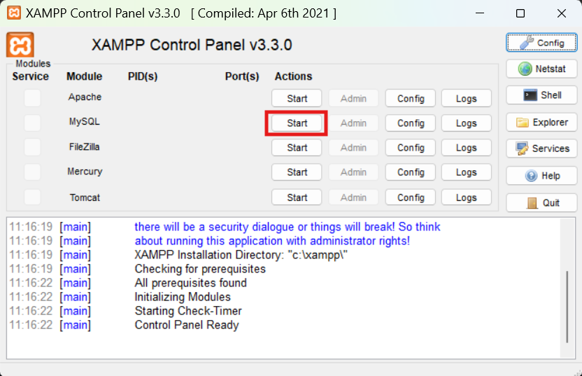
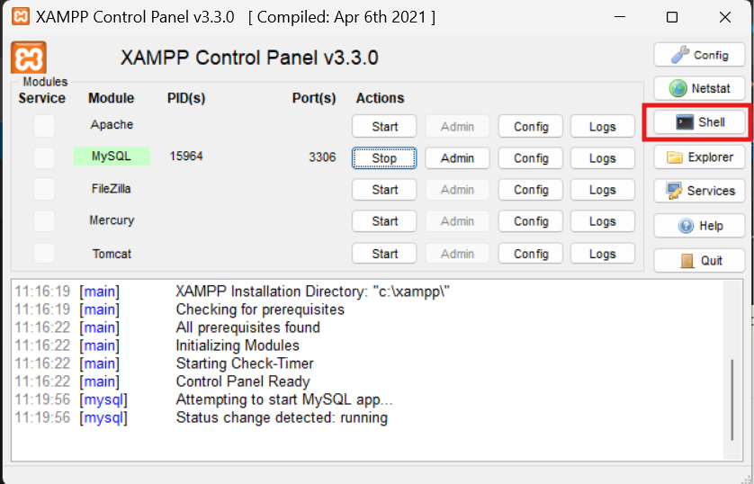

# mysql-structure (Cul d'Ampolla Optician)
**Description**: Design and data modeling of the relational database to manage clients, suppliers, employees, and custom-made prescription glasses sales for the "Cul d'Ampolla" optician shop.

## Technologies
- Database: MySQL (v8.0+)
- Character Set: utf8mb4
- Design Tool: PlantUML

## Installation
1. Clone the repository:
   ```bash
   git clone https://github.com/ander-luro/task1-sprint2.git
2. Press the button Start to initialize MySQL:
   
3. Open the Shell:
   
4. Open MariaDB terminal via XAMPP:
   ```bash
   mysql -u root -p
   ```
5. Execute the SQL script:
   ```sql
   SOURCE C:\xampp\htdocs\task1-sprint2\Level1\exercise1\optica.sql
   ```

## Demo
